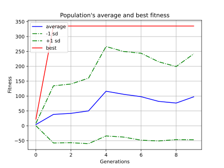

# AI-powered-FlappyBird
A Flappy Bird Game Trained( With Genetic algorithm for 10 Generations to a max of Score 30) to play by itself or user.
Either Use the trained model to play the game or Train a model before playing. 
**Note:** The model is set for the current playing conditions and might vary with different conditions.

## Setup
Run the Following commands in the command line before starting:

- python3 -m venv venv
- source venv/bin/activate
- pip3 install -r requirements.txt

### pygame installation might create problems 
**check this article to fix it**  
https://github.com/pygame/pygame/issues/1536#issuecomment-632600514

## Train

**RUN:** python3 Flappy_Train.py 

## Play

**RUN:** python3 Flappy_Game.py

### Playing instructions

- Use `UP arrow` key to move up
- Press `Spacebar` if you feel like not playing the game and let AI handle the rest

## Open to Contributions and Issues

- Feel Free to reach out to my email-id or github issues to contact
